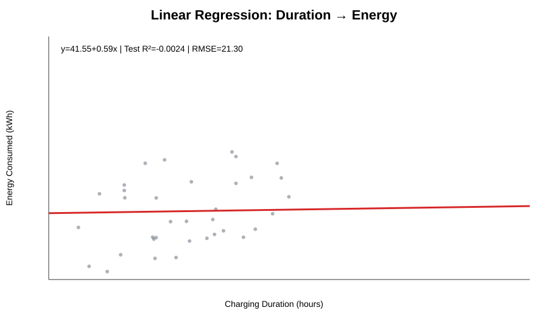
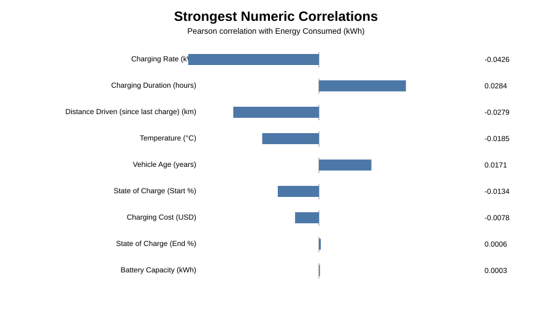
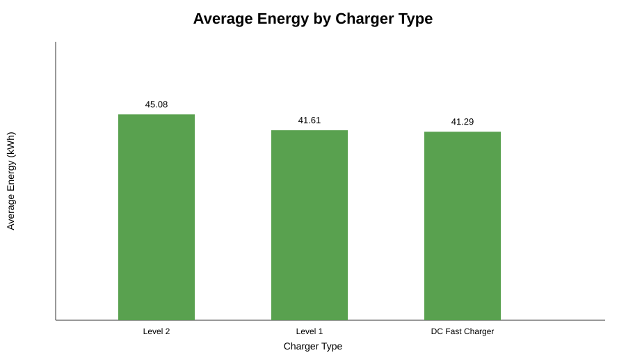
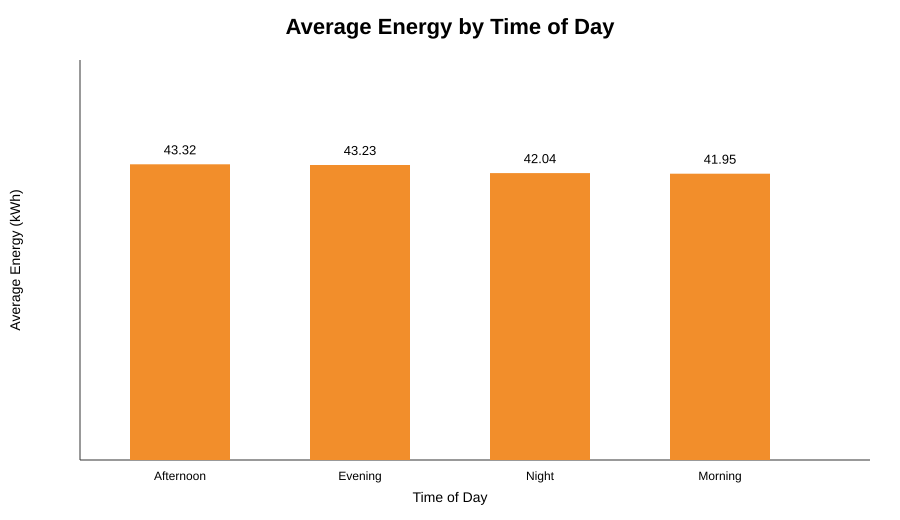
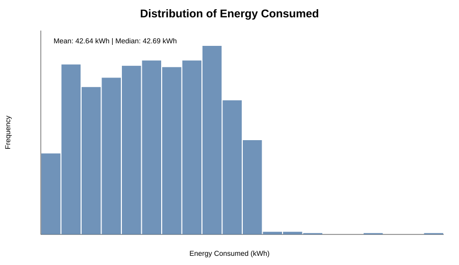
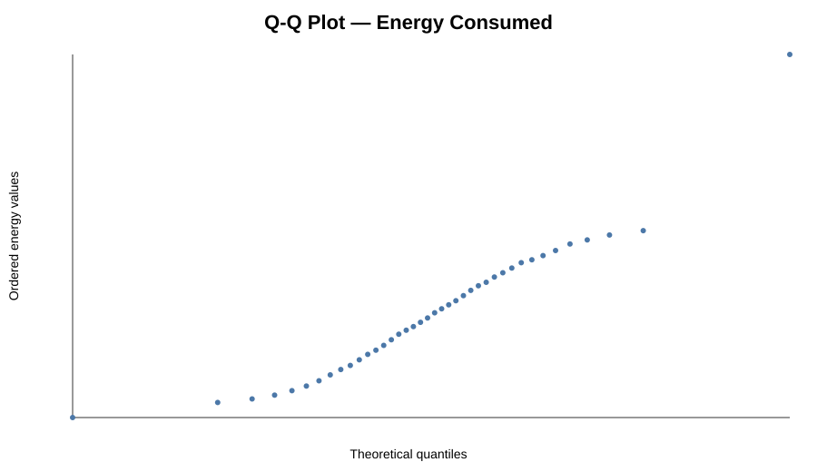
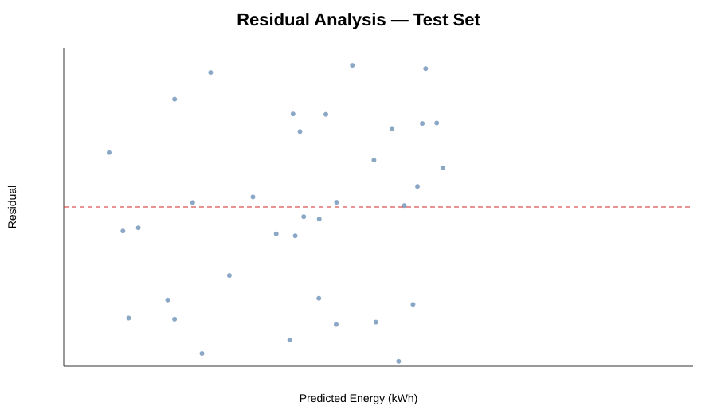

# EV Charging Statistical Analysis

[](https://www.python.org/)
[](https://scikit-learn.org/)
[](https://www.fiap.com.br/)

Statistical and machine learning analysis of electric-vehicle charging sessions using **Python, Pandas, NumPy, SciPy, Matplotlib and scikit-learn**.

This repository is a portfolio evolution of a FIAP Computer Science Challenge Sprint. The original academic implementation is preserved in `academic/`, while the portfolio version adds exploratory data analysis, statistical diagnostics, held-out model evaluation, automated outputs, tests and CI.

## Main question

> **How much of the variation in energy consumed by an EV charging session can be explained by charging duration alone?**

The answer from this dataset is: **almost none**.

That is the main analytical finding of the project.

## Key results

| Metric | Result |
| --- | ---: |
| Raw records | 1,320 |
| Valid records used | 1,254 |
| Mean energy consumed | 42.64 kWh |
| Median energy consumed | 42.69 kWh |
| Standard deviation | 22.41 kWh |
| Normal-model probability above median | 49.91% |
| Theoretical Normal probability inside mean ± 2 SD | 95.45% |
| Empirical observations inside the same interval | 99.52% |
| Train R² | 0.0008 |
| **Test R²** | **-0.0024** |
| Test MAE | 18.37 kWh |
| **Test RMSE** | **21.30 kWh** |
| Baseline RMSE | 21.31 kWh |

### Regression equation

```text
Energy Consumed = 41.5529 + (0.5908 × Charging Duration)
```

The held-out **R² is negative (-0.0024)** and the test RMSE (**21.30 kWh**) is virtually identical to the simple mean-value baseline (**21.31 kWh**). In practical terms, charging duration alone does not provide useful predictive power for energy consumption in this dataset.



## Exploratory findings

The strongest numerical correlations with `Energy Consumed (kWh)` are extremely weak:

| Variable | Pearson correlation |
| --- | ---: |
| Charging Rate (kW) | -0.0426 |
| Charging Duration (hours) | 0.0284 |
| Distance Driven (since last charge) (km) | -0.0279 |
| Temperature (°C) | -0.0185 |
| Vehicle Age (years) | 0.0171 |

No individual numerical variable shows a strong linear association with energy consumption.



### Charger type

| Charger type | Mean energy |
| --- | ---: |
| Level 2 | 45.08 kWh |
| Level 1 | 41.61 kWh |
| DC Fast Charger | 41.29 kWh |

These are descriptive differences only; the project does not claim that charger type causes higher energy consumption.



### Time of day

| Time of day | Mean energy |
| --- | ---: |
| Afternoon | 43.32 kWh |
| Evening | 43.23 kWh |
| Night | 42.04 kWh |
| Morning | 41.95 kWh |



## Probability and Normality

The original academic task uses probability calculations under a Normal Distribution assumption.

Using the fitted Normal model:

- probability above the sample median: **49.91%**;
- theoretical probability inside mean ± 2 standard deviations: **95.45%**.

The portfolio version also tests whether that assumption is appropriate. The D'Agostino-Pearson test returned:

```text
p-value = 2.076e-09
```

At a 5% significance level, the test **rejects normality**. The Q-Q plot also shows clear deviations in the tails. In addition, while a Normal model assigns 95.45% probability to mean ± 2 SD, the actual dataset places **99.52%** of observations inside the same interval.

This means the Normal-based probabilities are useful for demonstrating the academic method, but should not be presented as if the empirical distribution were truly Normal.





## Model evaluation

The academic version fits and evaluates the regression on the full dataset. The portfolio version improves this by using:

- **80/20 train/test split**;
- fixed `random_state=42` for reproducibility;
- **MAE**;
- **RMSE**;
- **train R² and test R²**;
- a mean-prediction baseline;
- residual diagnostics.

A negative test R² does **not** mean the project failed. It means the tested relationship is not useful for prediction on unseen data. Reporting that result correctly is more valuable than forcing an artificially strong metric.



## Data-leakage awareness

The dataset also contains variables such as `Charging Rate (kW)` and `Charging Cost (USD)`.

A future predictive model should verify how those fields were generated before using them as predictors. If a variable is calculated directly from energy consumed, using it to predict energy would create **target leakage** and misleadingly strong performance.

## Project structure

```text
ev-charging-statistical-analysis/
├── .github/
│   └── workflows/
│       └── python-check.yml
├── academic/
│   └── challenge_sprint3_final.py
├── assets/
│   ├── energy_by_charger_type.svg
│   ├── energy_by_time_of_day.svg
│   ├── energy_distribution.svg
│   ├── energy_qq_plot.svg
│   ├── linear_regression.svg
│   ├── numeric_correlation_matrix.svg
│   └── residuals.svg
├── data/
│   └── README.md
├── notebooks/
│   └── ev_charging_analysis.ipynb
├── outputs/
│   ├── analysis_results.json
│   ├── analysis_summary.md
│   ├── descriptive_statistics.csv
│   ├── energy_by_charger_type.csv
│   ├── energy_by_time_of_day.csv
│   └── numeric_correlations.csv
├── src/
│   └── analysis.py
├── tests/
│   └── test_analysis.py
├── .gitignore
├── PORTFOLIO_UPGRADE.md
├── requirements-dev.txt
├── requirements.txt
└── README.md
```

## Dataset

The analysis expects the original dataset at:

```text
data/ev_charging_patterns.csv
```

The analyzed file contains **1,320 rows and 20 columns**. The raw CSV is intentionally excluded because its redistribution license has not been confirmed. Aggregate results and charts are included so reviewers can still inspect the analysis directly.

## Installation

```bash
git clone https://github.com/LeonardoTakachi/ev-charging-statistical-analysis.git
cd ev-charging-statistical-analysis
python -m venv .venv
```

### Windows

```bash
.venv\Scripts\activate
pip install -r requirements.txt
```

### macOS / Linux

```bash
source .venv/bin/activate
pip install -r requirements.txt
```

## Run

After placing the dataset in `data/`:

```bash
python src/analysis.py
```

## Notebook

Open:

```text
notebooks/ev_charging_analysis.ipynb
```

It walks through loading, descriptive statistics, correlations, group comparisons, probability analysis and regression evaluation.

## Tests and CI

```bash
pip install -r requirements-dev.txt
pytest
```

GitHub Actions automatically compiles the Python files and executes the test suite on pushes and pull requests to `main`.

## Academic context

Developed from a **2nd-semester Computer Science Challenge Sprint at FIAP**.

Team:

- Daniel Vieira Santos
- Giovane Salazar Fioravante
- Gustavo Bitencourt Lopes
- Leonardo Basile Takachi

The original academic solution remains in `academic/challenge_sprint3_final.py`. The EDA, held-out evaluation, additional metrics, diagnostics, notebook, tests, CI and portfolio organization are separated transparently from the coursework.

## Skills demonstrated

`Python` · `Pandas` · `NumPy` · `SciPy` · `Matplotlib` · `scikit-learn` · `Statistics` · `Probability` · `Linear Regression` · `EDA` · `Model Evaluation` · `Pytest` · `GitHub Actions`

## Future improvements

- multivariate regression with carefully selected non-leaking features;
- feature engineering;
- cross-validation;
- comparison with regularized and non-linear models;
- prediction intervals;
- statistical tests for group differences;
- interactive dashboard.

---

### Recommended files for reviewers

1. [`README.md`](README.md) — conclusions and methodology
2. [`src/analysis.py`](src/analysis.py) — reproducible analysis pipeline
3. [`notebooks/ev_charging_analysis.ipynb`](notebooks/ev_charging_analysis.ipynb) — exploratory walkthrough
4. [`outputs/analysis_summary.md`](outputs/analysis_summary.md) — generated results
5. [`academic/challenge_sprint3_final.py`](academic/challenge_sprint3_final.py) — academic baseline
